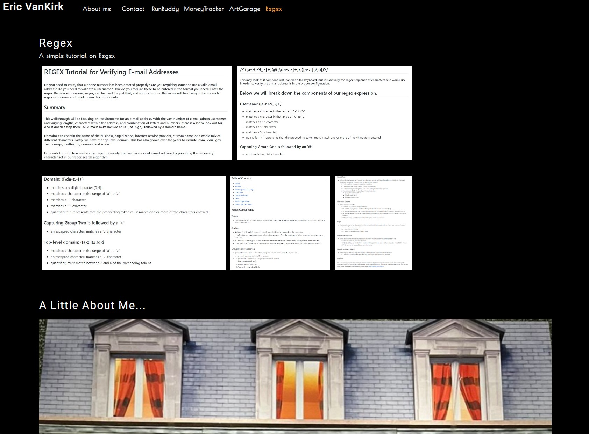

## Portfolio - Eric VanKirk

- Welcome to my journey of becomming a full stack web developer
- I started almost six months ago with very little knowledge of much of what we were to cover in this bootcamp, but soon a whole world of informations was opened up to me
- There is so much more to learn, but thus far I have completed several individual challenges to showcase my skills
- I have also worked on several group projects, using our group dynamic to utilize the particular strengths of each one of us in the group, and helped one another through any individual or group weaknesses, in order to overcome any obstacles.

https://github.com/BigEVK/ReactPortfolio

